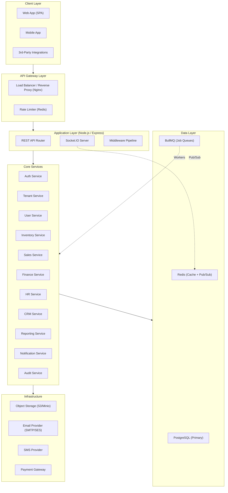
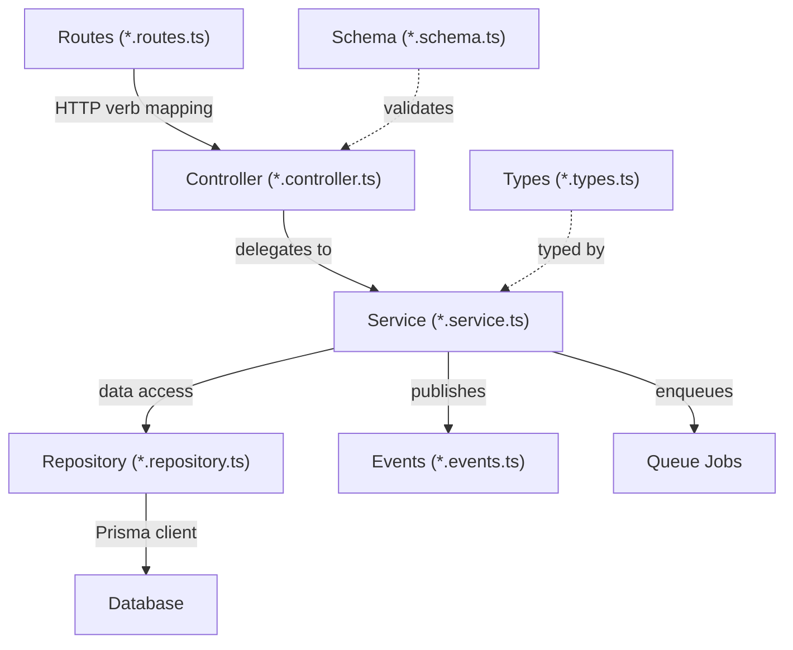
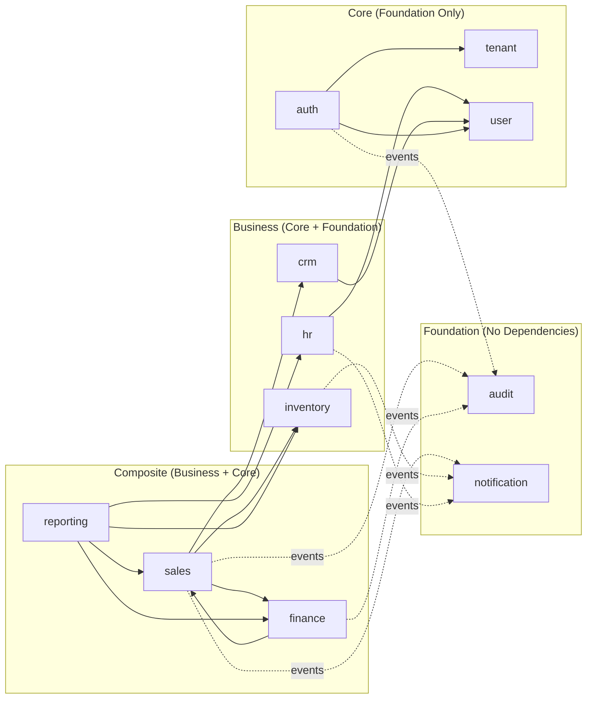
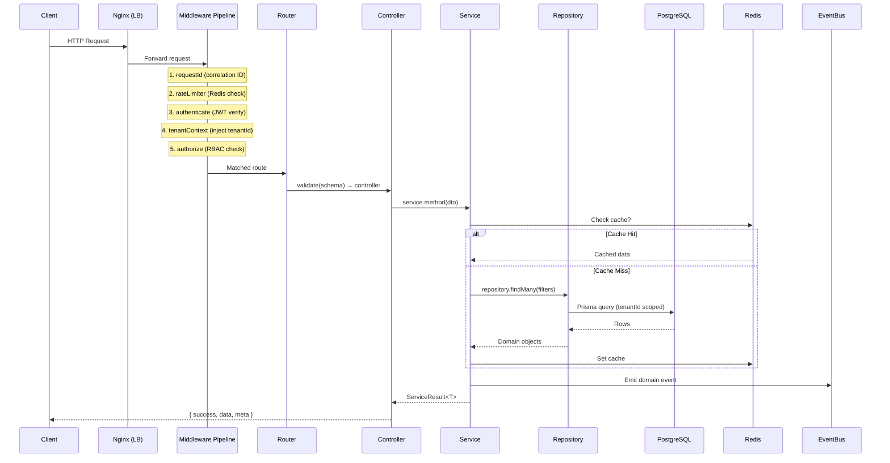
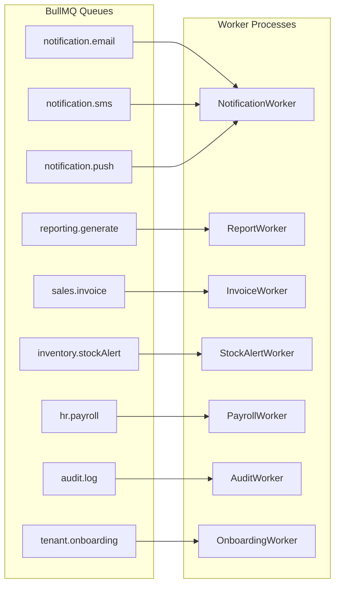
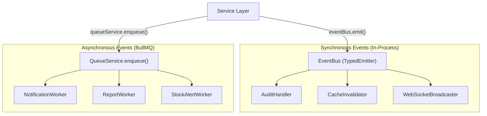
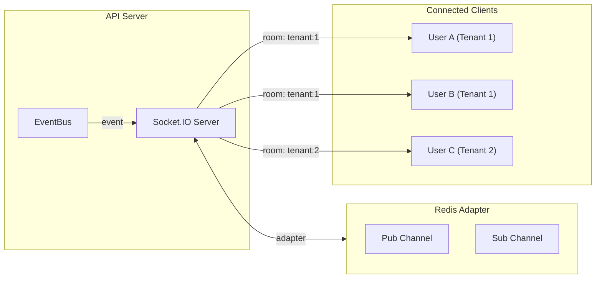

# BizOS Backend Architecture Design

A SaaS Business Operating System for small businesses.

**Tech Stack**: Node.js · Express.js · TypeScript · PostgreSQL · Prisma · Redis · BullMQ · Socket.IO

---

## 1. High-Level Architecture



### Architecture Style: **Modular Monolith**

BizOS uses a **modular monolith** architecture — not microservices. This is the right choice because:

1. **Small business SaaS** doesn't need the operational overhead of microservices at launch
2. Modules are **logically isolated** with clear boundaries, making future extraction trivial
3. A single deployable unit simplifies DevOps, debugging, and transactional consistency
4. Each module owns its own Prisma models, services, and routes — enforcing separation

> [!IMPORTANT]
> Each module communicates with others **only** through its public service interface (the module's `index.ts` barrel export). Direct cross-module database access or repository imports are **strictly forbidden**.

---

## 2. Folder Structure

```
d:\script\BizOs-Backend\
├── prisma/
│   ├── schema.prisma              # Unified Prisma schema (all modules)
│   ├── migrations/                # Auto-generated migrations
│   └── seed.ts                    # Database seeding script
│
├── src/
│   ├── app.ts                     # Express app setup (middleware, routes)
│   ├── server.ts                  # Entry point: HTTP + Socket.IO bootstrap
│   ├── env.ts                     # Environment variable validation (zod)
│   │
│   ├── config/
│   │   ├── database.ts            # Prisma client singleton
│   │   ├── redis.ts               # Redis client singleton
│   │   ├── bull.ts                # BullMQ connection + queue registry
│   │   ├── socket.ts              # Socket.IO server setup
│   │   ├── logger.ts              # Structured logger (pino/winston)
│   │   └── cors.ts                # CORS configuration
│   │
│   ├── common/
│   │   ├── middleware/
│   │   │   ├── authenticate.ts    # JWT verification middleware
│   │   │   ├── authorize.ts       # RBAC permission guard
│   │   │   ├── rateLimiter.ts     # Redis-backed rate limiting
│   │   │   ├── tenantContext.ts   # Extract & inject tenant context
│   │   │   ├── validate.ts        # Zod schema validation middleware
│   │   │   ├── errorHandler.ts    # Global error handler
│   │   │   └── requestId.ts       # Correlation ID injection
│   │   │
│   │   ├── errors/
│   │   │   ├── AppError.ts        # Base error class
│   │   │   ├── NotFoundError.ts
│   │   │   ├── ValidationError.ts
│   │   │   ├── UnauthorizedError.ts
│   │   │   ├── ForbiddenError.ts
│   │   │   └── ConflictError.ts
│   │   │
│   │   ├── types/
│   │   │   ├── express.d.ts       # Augmented Request (tenant, user)
│   │   │   ├── pagination.ts      # Pagination types
│   │   │   ├── service.ts         # Base service result type
│   │   │   └── repository.ts      # Base repository interface
│   │   │
│   │   ├── utils/
│   │   │   ├── pagination.ts      # Cursor/offset pagination helpers
│   │   │   ├── slug.ts            # Slug generation
│   │   │   ├── crypto.ts          # Hashing, token generation
│   │   │   ├── date.ts            # Date/timezone utilities
│   │   │   └── response.ts        # Standard API response builder
│   │   │
│   │   ├── events/
│   │   │   ├── eventBus.ts        # In-process event emitter (typed)
│   │   │   ├── eventTypes.ts      # All domain event type definitions
│   │   │   └── eventHandlers.ts   # Cross-module event handler registry
│   │   │
│   │   └── queues/
│   │       ├── queueRegistry.ts   # Central queue name registry
│   │       ├── baseWorker.ts      # Abstract worker with error handling
│   │       └── queueService.ts    # Enqueue helper functions
│   │
│   ├── modules/
│   │   ├── auth/
│   │   │   ├── index.ts           # Public barrel export
│   │   │   ├── auth.routes.ts
│   │   │   ├── auth.controller.ts
│   │   │   ├── auth.service.ts
│   │   │   ├── auth.repository.ts
│   │   │   ├── auth.schema.ts     # Zod validation schemas
│   │   │   ├── auth.types.ts      # Module-specific types/interfaces
│   │   │   ├── auth.events.ts     # Event publishers for this module
│   │   │   └── strategies/
│   │   │       ├── jwt.strategy.ts
│   │   │       └── oauth.strategy.ts
│   │   │
│   │   ├── tenant/
│   │   │   ├── index.ts
│   │   │   ├── tenant.routes.ts
│   │   │   ├── tenant.controller.ts
│   │   │   ├── tenant.service.ts
│   │   │   ├── tenant.repository.ts
│   │   │   ├── tenant.schema.ts
│   │   │   ├── tenant.types.ts
│   │   │   └── tenant.events.ts
│   │   │
│   │   ├── user/
│   │   │   ├── index.ts
│   │   │   ├── user.routes.ts
│   │   │   ├── user.controller.ts
│   │   │   ├── user.service.ts
│   │   │   ├── user.repository.ts
│   │   │   ├── user.schema.ts
│   │   │   └── user.types.ts
│   │   │
│   │   ├── inventory/
│   │   │   ├── index.ts
│   │   │   ├── inventory.routes.ts
│   │   │   ├── inventory.controller.ts
│   │   │   ├── inventory.service.ts
│   │   │   ├── inventory.repository.ts
│   │   │   ├── inventory.schema.ts
│   │   │   ├── inventory.types.ts
│   │   │   ├── inventory.events.ts
│   │   │   └── workers/
│   │   │       └── stockAlert.worker.ts
│   │   │
│   │   ├── sales/
│   │   │   ├── index.ts
│   │   │   ├── sales.routes.ts
│   │   │   ├── sales.controller.ts
│   │   │   ├── sales.service.ts
│   │   │   ├── sales.repository.ts
│   │   │   ├── sales.schema.ts
│   │   │   ├── sales.types.ts
│   │   │   ├── sales.events.ts
│   │   │   └── workers/
│   │   │       └── invoiceGeneration.worker.ts
│   │   │
│   │   ├── finance/
│   │   │   ├── index.ts
│   │   │   ├── finance.routes.ts
│   │   │   ├── finance.controller.ts
│   │   │   ├── finance.service.ts
│   │   │   ├── finance.repository.ts
│   │   │   ├── finance.schema.ts
│   │   │   ├── finance.types.ts
│   │   │   └── finance.events.ts
│   │   │
│   │   ├── hr/
│   │   │   ├── index.ts
│   │   │   ├── hr.routes.ts
│   │   │   ├── hr.controller.ts
│   │   │   ├── hr.service.ts
│   │   │   ├── hr.repository.ts
│   │   │   ├── hr.schema.ts
│   │   │   ├── hr.types.ts
│   │   │   └── workers/
│   │   │       └── payroll.worker.ts
│   │   │
│   │   ├── crm/
│   │   │   ├── index.ts
│   │   │   ├── crm.routes.ts
│   │   │   ├── crm.controller.ts
│   │   │   ├── crm.service.ts
│   │   │   ├── crm.repository.ts
│   │   │   ├── crm.schema.ts
│   │   │   ├── crm.types.ts
│   │   │   └── crm.events.ts
│   │   │
│   │   ├── notification/
│   │   │   ├── index.ts
│   │   │   ├── notification.routes.ts
│   │   │   ├── notification.controller.ts
│   │   │   ├── notification.service.ts
│   │   │   ├── notification.repository.ts
│   │   │   ├── notification.schema.ts
│   │   │   ├── notification.types.ts
│   │   │   ├── channels/
│   │   │   │   ├── email.channel.ts
│   │   │   │   ├── sms.channel.ts
│   │   │   │   ├── push.channel.ts
│   │   │   │   └── inApp.channel.ts
│   │   │   └── workers/
│   │   │       └── notification.worker.ts
│   │   │
│   │   ├── reporting/
│   │   │   ├── index.ts
│   │   │   ├── reporting.routes.ts
│   │   │   ├── reporting.controller.ts
│   │   │   ├── reporting.service.ts
│   │   │   ├── reporting.repository.ts
│   │   │   ├── reporting.schema.ts
│   │   │   └── workers/
│   │   │       └── reportGeneration.worker.ts
│   │   │
│   │   └── audit/
│   │       ├── index.ts
│   │       ├── audit.service.ts
│   │       ├── audit.repository.ts
│   │       └── audit.types.ts
│   │
│   └── workers/
│       └── index.ts               # Worker process entry point
│
├── tests/
│   ├── unit/
│   │   └── modules/               # Mirrors src/modules/
│   ├── integration/
│   │   └── modules/
│   └── e2e/
│       └── api/
│
├── docker/
│   ├── Dockerfile
│   ├── Dockerfile.worker          # Separate image for queue workers
│   └── docker-compose.yml         # PG + Redis + App + Worker
│
├── .env.example
├── .eslintrc.cjs
├── .prettierrc
├── tsconfig.json
├── package.json
└── README.md
```

---

## 3. Module Structure — Internal Anatomy

Every module follows a strict **layered architecture** with consistent file naming:



### Layer Responsibilities

| Layer | File | Responsibility |
|-------|------|----------------|
| **Route** | `*.routes.ts` | HTTP method + path mapping, middleware attachment (auth, validation, rate-limit) |
| **Controller** | `*.controller.ts` | Parse request, call service, format HTTP response. **No business logic.** |
| **Schema** | `*.schema.ts` | Zod schemas for request body/query/params validation |
| **Service** | `*.service.ts` | All business logic, orchestration, transaction coordination, event publishing |
| **Repository** | `*.repository.ts` | Prisma queries abstracted behind a clean interface. **No business logic.** |
| **Types** | `*.types.ts` | DTOs, interfaces, enums scoped to this module |
| **Events** | `*.events.ts` | Domain event publishers — what this module broadcasts to the system |
| **Workers** | `workers/*.worker.ts` | BullMQ job processors for async tasks belonging to this module |

### Barrel Export Pattern (`index.ts`)

Each module's `index.ts` exposes **only** the public API:

```
// modules/inventory/index.ts — ONLY these are importable by other modules
export { inventoryRoutes } from './inventory.routes';
export { InventoryService } from './inventory.service';
export type { Product, StockLevel } from './inventory.types';
```

> [!WARNING]
> Other modules **must never** import a module's repository, controller, schema, or internal types directly. All cross-module communication flows through the exported service class.

---

## 4. Dependency Boundaries

### Module Dependency Graph



### Dependency Rules

| Layer | Can Depend On | Cannot Depend On |
|-------|--------------|-----------------|
| **Foundation** | `common/` only | Any other module |
| **Core** | `common/`, Foundation modules | Business, Composite modules |
| **Business** | `common/`, Foundation, Core | Composite modules |
| **Composite** | `common/`, Foundation, Core, Business | — |

### Cross-Cutting Concerns (always available)

These are **not modules** — they are shared infrastructure in `common/`:
- Error handling, logging, request context
- Tenant context injection
- Event bus, queue service
- Pagination, response formatting

> [!IMPORTANT]
> **Circular dependency between Sales ↔ Finance**: This is resolved by using the **event bus** for the Finance → Sales direction. Sales calls Finance directly for pricing/tax calculation. Finance emits events (e.g., `payment.received`) that Sales listens to.

---

## 5. Request Flow

### Synchronous Request Flow (REST API)



### Middleware Pipeline Order

```
Request →
  1. requestId         — Attach unique correlation ID (X-Request-ID)
  2. logger            — Log incoming request
  3. cors              — CORS headers
  4. bodyParser         — JSON parsing
  5. rateLimiter       — Redis sliding window rate limit
  6. authenticate      — JWT token verification → req.user
  7. tenantContext     — Extract tenantId → req.tenantId (from JWT or header)
  8. [route-specific]  — validate(schema), authorize('permission')
  → Controller
  → errorHandler      — Catch-all error formatting
```

### Multi-Tenant Data Isolation

Every database query is **automatically scoped to the tenant**:

```
// The tenantContext middleware injects tenantId into req
// Repository methods ALWAYS include tenantId in WHERE clauses
// This is enforced by the base repository pattern (Section 7)
```

---

## 6. Service Layer Design

### Service Structure

```
┌──────────────────────────────────────────────┐
│                Service Layer                  │
├──────────────────────────────────────────────┤
│  Input:   DTOs (validated by controller)      │
│  Output:  ServiceResult<T>                    │
│  Deps:    Own repository, other services,     │
│           event bus, queue service, cache      │
│  Rules:   All business logic lives here       │
│           Transactions coordinated here       │
│           Events published here               │
└──────────────────────────────────────────────┘
```

### ServiceResult Pattern

All services return a consistent result type:

```
ServiceResult<T> = {
  success: boolean;
  data?: T;
  error?: {
    code: string;        // Machine-readable: 'INVENTORY_INSUFFICIENT'
    message: string;     // Human-readable message
  };
  meta?: {
    pagination?: PaginationMeta;
    cached?: boolean;
  };
}
```

### Dependency Injection Strategy

BizOS uses **manual constructor injection** (no DI framework — keeps it simple):

```
// Service receives its dependencies via constructor
class SalesService {
  constructor(
    private salesRepo: SalesRepository,
    private inventoryService: InventoryService,   // cross-module: via barrel export
    private financeService: FinanceService,
    private eventBus: EventBus,
    private queueService: QueueService,
    private cache: CacheService
  ) {}
}
```

A central **composition root** (`src/container.ts`) wires all dependencies at startup. This file is the **only place** where modules are cross-wired.

### Transaction Strategy

| Scenario | Strategy |
|----------|----------|
| Single-module writes | Prisma implicit transaction (nested writes) |
| Multi-step within one module | `prisma.$transaction([...])` interactive transaction |
| Cross-module writes | **Saga pattern via events**: Service A commits → emits event → Service B processes. Compensating actions on failure. |
| Idempotency | All mutating endpoints accept an `Idempotency-Key` header, stored in Redis with 24h TTL |

---

## 7. Repository Pattern Design

### Base Repository Interface

```
interface IBaseRepository<T, CreateDTO, UpdateDTO> {
  findById(tenantId: string, id: string): Promise<T | null>;
  findMany(tenantId: string, filters: FilterParams): Promise<PaginatedResult<T>>;
  create(tenantId: string, data: CreateDTO): Promise<T>;
  update(tenantId: string, id: string, data: UpdateDTO): Promise<T>;
  softDelete(tenantId: string, id: string): Promise<void>;
  exists(tenantId: string, id: string): Promise<boolean>;
}
```

### Key Design Decisions

| Decision | Rationale |
|----------|-----------|
| **tenantId is always the first parameter** | Prevents accidental cross-tenant data leaks. Impossible to forget. |
| **Soft delete by default** | All entities have `deletedAt: DateTime?`. Hard delete is a separate, audited operation. |
| **No Prisma types leak beyond repository** | Repository maps Prisma models → domain types defined in `*.types.ts` |
| **Pagination built-in** | `findMany` always returns `PaginatedResult<T>` with cursor-based pagination |
| **No raw SQL** | All queries go through Prisma. If raw SQL is needed, it's encapsulated in the repository with a clear comment. |

### Repository → Prisma Mapping

```
┌─────────────────┐       ┌──────────────────┐       ┌─────────────┐
│  Service Layer   │──────▶│   Repository     │──────▶│  Prisma ORM │
│ (domain types)   │       │ (maps ↔ Prisma)  │       │ (DB types)  │
└─────────────────┘       └──────────────────┘       └─────────────┘

Example:
  Service receives:  Product { id, name, sku, price, stockLevel }
  Repository maps:   PrismaProduct → Product (strips internal fields)
  Prisma returns:    { id, tenant_id, name, sku, price_cents, stock_level, created_at, updated_at, deleted_at }
```

### Caching Strategy (Redis)

| Pattern | Use Case | TTL |
|---------|----------|-----|
| **Cache-aside** | Read-heavy entities (products, settings) | 5-15 min |
| **Write-through** | Tenant config, feature flags | On mutation |
| **Cache invalidation** | On any write, invalidate related keys | — |
| **Key format** | `bizos:{tenantId}:{module}:{entity}:{id}` | — |

---

## 8. Queue Architecture (BullMQ)

### Queue Topology



### Queue Design Principles

| Principle | Implementation |
|-----------|---------------|
| **Separate process** | Workers run in a dedicated process (`src/workers/index.ts`), not the API server |
| **Retry with backoff** | All queues configured with exponential backoff: 3 attempts, base 2s |
| **Dead letter queue** | Failed jobs after max retries move to `*.failed` queue for manual inspection |
| **Job priority** | `notification.email` supports priority levels (password reset > marketing) |
| **Concurrency** | Each worker type has tunable concurrency (e.g., email=10, report=2, payroll=1) |
| **Rate limiting** | External API queues (email, SMS) have per-tenant rate limits |
| **Job deduplication** | Jobs include a `jobId` derived from idempotency key to prevent duplicates |

### Queue Registry

All queue names are centrally defined in `common/queues/queueRegistry.ts`:

```
QUEUE_NAMES = {
  NOTIFICATION_EMAIL: 'notification.email',
  NOTIFICATION_SMS:   'notification.sms',
  NOTIFICATION_PUSH:  'notification.push',
  REPORTING_GENERATE: 'reporting.generate',
  SALES_INVOICE:      'sales.invoice',
  INVENTORY_STOCK:    'inventory.stockAlert',
  HR_PAYROLL:         'hr.payroll',
  AUDIT_LOG:          'audit.log',
  TENANT_ONBOARDING:  'tenant.onboarding',
}
```

### Worker Base Class

All workers extend a `BaseWorker` that provides:
- Structured logging with job context
- Error capture and reporting
- Graceful shutdown handling
- Health check endpoint for orchestration
- Tenant context injection for multi-tenant jobs

---

## 9. Event Architecture

### Event System — Dual Layer

BizOS uses **two complementary event mechanisms**:



| Mechanism | When to Use | Delivery | Failure Handling |
|-----------|------------|----------|------------------|
| **EventBus** (sync) | Side effects that must happen in the same request cycle: audit logging, cache invalidation, real-time WebSocket push | In-process, immediate | Try-catch in handler, log errors, don't break the main flow |
| **BullMQ** (async) | Work that is slow, unreliable, or can be deferred: emails, PDF generation, payroll, reports | Persisted in Redis, processed by workers | Retry with backoff, dead letter queue |

### Domain Event Catalog

| Event | Emitted By | Sync Handlers | Async Handlers |
|-------|-----------|---------------|----------------|
| `tenant.created` | Tenant Service | Audit | Onboarding worker (seed data, welcome email) |
| `user.registered` | Auth Service | Audit | Welcome email |
| `user.login` | Auth Service | Audit, Session tracking | — |
| `order.created` | Sales Service | Audit, Cache invalidation | Invoice generation, stock update notification |
| `order.completed` | Sales Service | Audit | Finance journal entry, CRM activity log |
| `payment.received` | Finance Service | Audit, Cache invalidation | Receipt email, Sales order status update |
| `inventory.lowStock` | Inventory Service | — | Stock alert notification |
| `employee.onboarded` | HR Service | Audit | Welcome kit email, account provisioning |
| `report.requested` | Reporting Service | — | Report generation worker |

### Socket.IO Real-Time Architecture



**Socket.IO Design**:
- Uses **Redis adapter** for horizontal scaling (multiple API server instances)
- Clients join a **tenant-scoped room** (`tenant:{tenantId}`) on connection
- Authentication via Socket.IO middleware (same JWT as REST)
- Events broadcasted: notifications, real-time dashboard updates, collaboration events
- Namespace separation: `/notifications`, `/dashboard`, `/collaboration`

---

## 10. Multi-Tenancy Strategy

| Aspect | Approach |
|--------|----------|
| **Isolation model** | Shared database, shared schema, tenant column discrimination (`tenantId` on every table) |
| **Tenant identification** | JWT claim `tenantId`, validated against `tenants` table |
| **Query scoping** | Repository base class enforces `WHERE tenantId = ?` on every query |
| **Data migration** | Prisma migrations are tenant-agnostic (single schema) |
| **Tenant onboarding** | Async BullMQ job seeds default data (roles, permissions, settings) |
| **Tenant config** | Per-tenant settings stored in `tenant_settings` table, cached in Redis |

---

## 11. Authentication & Authorization

### Auth Flow

```
1. Register → hash password (argon2) → store user → emit user.registered
2. Login    → verify password → generate JWT (access + refresh) → emit user.login
3. Refresh  → validate refresh token (Redis) → issue new pair
4. Logout   → blacklist refresh token in Redis
```

### RBAC Model

```
Tenant → Roles → Permissions

Permission format: "module:resource:action"
Examples:
  - "inventory:product:read"
  - "sales:order:create"
  - "hr:employee:delete"
  - "finance:*:*"           (finance admin)
  - "*:*:*"                  (super admin)
```

Default roles seeded per tenant: `owner`, `admin`, `manager`, `employee`, `viewer`

---

## 12. Error Handling Strategy

### Error Hierarchy

```
AppError (base)
├── ValidationError     (400)
├── UnauthorizedError   (401)
├── ForbiddenError      (403)
├── NotFoundError       (404)
├── ConflictError       (409)
├── RateLimitError      (429)
└── InternalError       (500)
```

### Standard Error Response

```json
{
  "success": false,
  "error": {
    "code": "INVENTORY_INSUFFICIENT_STOCK",
    "message": "Not enough stock for product SKU-001",
    "details": [
      { "field": "quantity", "message": "Requested 50, available 12" }
    ],
    "requestId": "req_abc123"
  }
}
```

---

## 13. API Design Conventions

| Convention | Standard |
|-----------|----------|
| **Base path** | `/api/v1/{module}/{resource}` |
| **Naming** | Plural nouns: `/api/v1/inventory/products` |
| **Versioning** | URL path prefix (`/v1/`, `/v2/`) |
| **Pagination** | Cursor-based: `?cursor=xyz&limit=25` |
| **Filtering** | Query params: `?status=active&category=electronics` |
| **Sorting** | `?sort=createdAt:desc,name:asc` |
| **Search** | `?search=keyword` (full-text via PG tsvector) |
| **Response envelope** | `{ success, data, meta, error }` |
| **Dates** | ISO 8601, always UTC |
| **IDs** | CUID2 (collision-resistant, sortable) |

---

## User Review Required

> [!IMPORTANT]
> **Module scope**: The design includes 11 modules (auth, tenant, user, inventory, sales, finance, HR, CRM, notification, reporting, audit). Should we prioritize a subset for the initial build? Recommended MVP modules: **auth, tenant, user, inventory, sales, notification, audit**.

> [!IMPORTANT]
> **Multi-tenancy model**: The design uses a **shared database with tenant column discrimination**. This is the simplest and most cost-effective for small business SaaS, but limits data isolation. Should we consider schema-per-tenant for stronger isolation?

## Open Questions

1. **Payment integration**: Which payment gateway(s) should be supported? (Stripe, Paddle, SSLCommerz, bKash, etc.)
2. **File storage**: Should we use AWS S3, Cloudflare R2, or a self-hosted solution like MinIO for file storage (invoices, reports, avatars)?
3. **Email provider**: Preference for transactional email? (AWS SES, Resend, SendGrid, Nodemailer with SMTP)
4. **Deployment target**: Where will this be deployed? (AWS, DigitalOcean, VPS, Docker Swarm, Kubernetes) — this affects infrastructure code.
5. **API documentation**: Should we integrate Swagger/OpenAPI auto-generation from Zod schemas?
6. **Internationalization**: Does BizOS need multi-language support (i18n) for API error messages and email templates?
7. **Subscription billing**: Is there a billing/subscription module needed for SaaS tiers? Or is this handled externally?

## Verification Plan

### Automated Tests
- Architectural boundary tests using dependency-cruiser or custom lint rules to enforce module boundaries
- Unit tests for services and repositories
- Integration tests for API endpoints
- E2e tests for critical user flows

### Manual Verification
- Review the architecture diagram with stakeholders
- Validate module boundaries against actual business requirements
- Load test the multi-tenant query scoping pattern
