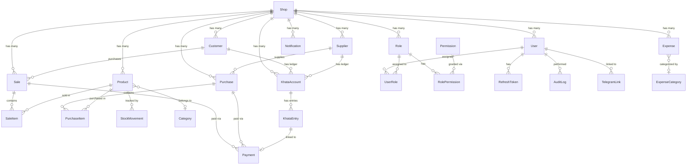
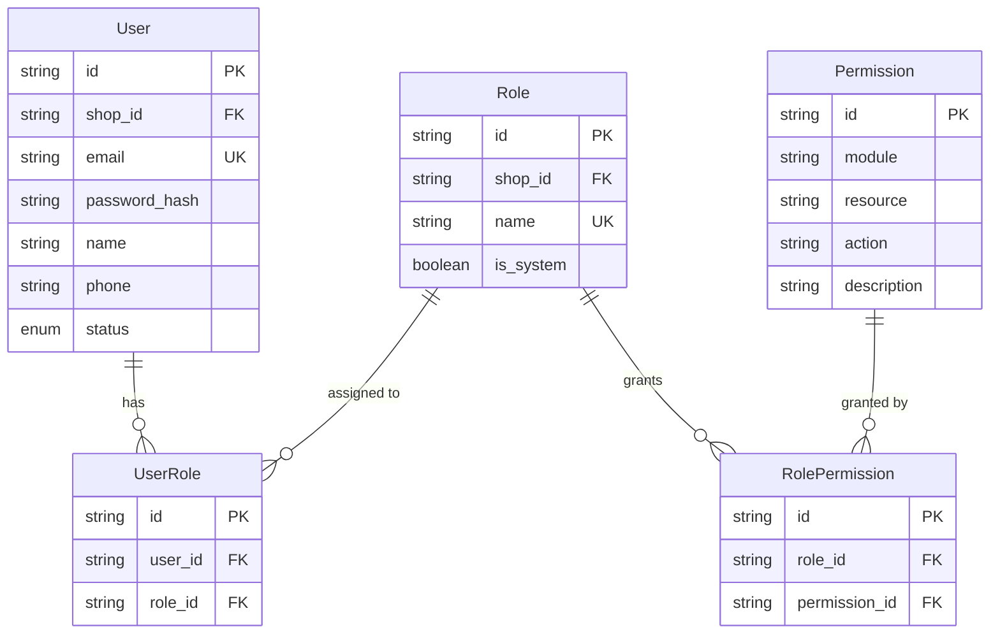
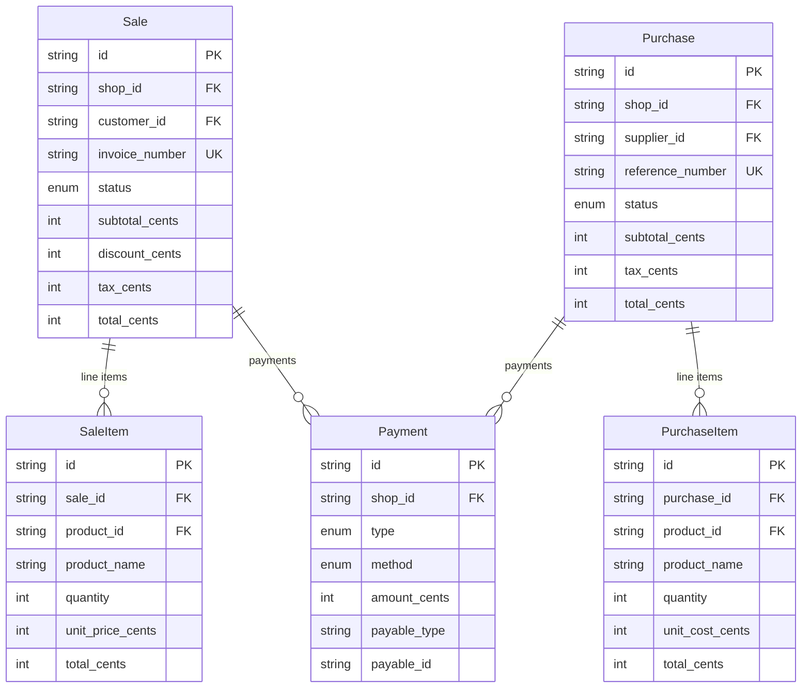
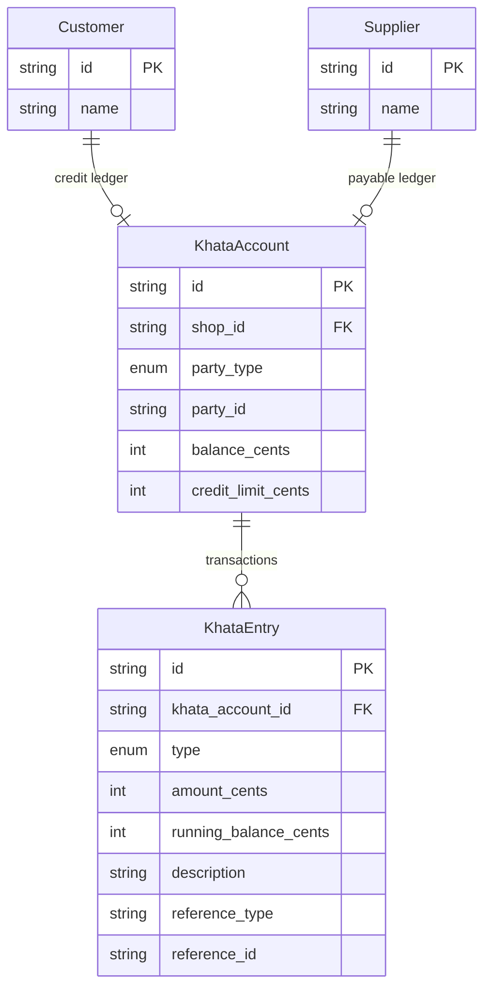

# BizOS — Complete PostgreSQL Database Schema Design

**Senior Database Architect · Design Document v2.0**

> [!IMPORTANT]
> This schema **replaces** the previous design. The old schema included HR, CRM, and Finance modules designed for enterprise SaaS. This new schema is purpose-built for **small business retail/trade operations** in South Asia — with Khata (credit ledger), Suppliers, Purchase management, and Telegram integration.

---

## 1. Multi-Tenant Strategy

| Decision | Choice | Rationale |
|----------|--------|-----------|
| **Isolation model** | Shared database, shared schema, `shop_id` column discrimination | Lowest cost, simplest ops for SMB SaaS |
| **Tenant entity** | `Shop` (not "Tenant") | Domain-accurate — every business is a "shop" |
| **Tenant ID column** | `shop_id` on every business table | Consistent naming, enforced via repository layer |
| **Data isolation** | `WHERE shop_id = ?` on every query + Prisma middleware | Prevents cross-tenant data leaks |
| **Tenant identification** | JWT claim `shopId` → trusted, cannot be spoofed | Not from URL/header |
| **Row-Level Security** | PostgreSQL RLS policies as a defense-in-depth layer | Second barrier beyond application code |

### Row-Level Security Policy (defense-in-depth)

```sql
-- Applied to every tenant-scoped table
ALTER TABLE products ENABLE ROW LEVEL SECURITY;

CREATE POLICY tenant_isolation ON products
  USING (shop_id = current_setting('app.current_shop_id')::TEXT);
```

> [!NOTE]
> RLS is a **secondary** guard. The primary isolation is at the application layer (repository base class always injects `shop_id` in WHERE clauses). RLS catches bugs — it's not the primary mechanism.

---

## 2. Soft Delete Strategy

| Decision | Choice |
|----------|--------|
| **Column** | `deleted_at TIMESTAMPTZ NULL` on every soft-deletable table |
| **Default** | `NULL` = not deleted |
| **Query filtering** | All queries include `WHERE deleted_at IS NULL` (enforced by Prisma middleware) |
| **Hard delete** | Separate audited operation; only for data compliance (GDPR) |
| **Exceptions** | Audit logs, stock movements, payments — **never** soft-deleted (immutable ledger) |
| **Cascading** | Soft-deleting a Shop cascades soft-delete to all child entities |
| **Unique constraints** | Use partial unique indexes: `WHERE deleted_at IS NULL` to allow re-creation after delete |

### Partial Unique Index Pattern

```sql
-- Allows re-creating a product with the same SKU after the old one is soft-deleted
CREATE UNIQUE INDEX uq_products_shop_sku 
  ON products (shop_id, sku) 
  WHERE deleted_at IS NULL;
```

---

## 3. Entity-Relationship Diagram

### Core Domain ERD



### Auth & Permissions ERD



### Sales & Purchases ERD



### Khata (Credit Ledger) ERD



---

## 4. Complete Table Definitions

### Conventions

| Convention | Standard |
|-----------|----------|
| **Primary key** | `id` — CUID2 string, generated by application |
| **Foreign keys** | `{entity}_id` — e.g., `shop_id`, `customer_id` |
| **Timestamps** | `created_at`, `updated_at`, `deleted_at` — all `TIMESTAMPTZ` |
| **Money** | Store in **cents** (integer) — never float. Column suffix: `_cents` |
| **Booleans** | `is_` prefix — e.g., `is_active`, `is_system` |
| **Enums** | PostgreSQL native ENUMs for fixed value sets |
| **Table names** | Plural, snake_case: `products`, `sale_items` |
| **Column names** | Singular, snake_case: `shop_id`, `unit_price_cents` |
| **JSON columns** | Used sparingly for truly unstructured data (addresses, settings, metadata) |

---

### 4.1 `shops` — Multi-Tenant Root Entity

| Column | Type | Constraints | Description |
|--------|------|-------------|-------------|
| `id` | `TEXT` | PK | CUID2 |
| `name` | `VARCHAR(200)` | NOT NULL | Business name |
| `slug` | `VARCHAR(200)` | UNIQUE, NOT NULL | URL-safe identifier |
| `phone` | `VARCHAR(20)` | | Business phone |
| `email` | `VARCHAR(255)` | | Business email |
| `address` | `JSONB` | DEFAULT '{}' | `{ street, city, state, zip, country }` |
| `logo` | `TEXT` | | Logo URL |
| `currency` | `VARCHAR(3)` | DEFAULT 'BDT', NOT NULL | ISO 4217 currency code |
| `timezone` | `VARCHAR(50)` | DEFAULT 'Asia/Dhaka' | IANA timezone |
| `status` | `ENUM shop_status` | DEFAULT 'ACTIVE' | ACTIVE, SUSPENDED, TRIAL, CANCELLED |
| `plan` | `ENUM shop_plan` | DEFAULT 'FREE' | FREE, STARTER, PROFESSIONAL, ENTERPRISE |
| `settings` | `JSONB` | DEFAULT '{}' | Flexible shop-specific config |
| `created_at` | `TIMESTAMPTZ` | DEFAULT NOW() | |
| `updated_at` | `TIMESTAMPTZ` | AUTO | |
| `deleted_at` | `TIMESTAMPTZ` | NULL | Soft delete |

**Indexes**: `slug` (UNIQUE)

> [!NOTE]
> Default currency is `BDT` (Bangladeshi Taka) and timezone `Asia/Dhaka` — tuned for the primary market. Shops can override these.

---

### 4.2 `users` — System Users

| Column | Type | Constraints | Description |
|--------|------|-------------|-------------|
| `id` | `TEXT` | PK | CUID2 |
| `shop_id` | `TEXT` | FK → shops.id, NOT NULL | Tenant scope |
| `name` | `VARCHAR(200)` | NOT NULL | Full display name |
| `email` | `VARCHAR(255)` | NOT NULL | Login email |
| `phone` | `VARCHAR(20)` | | Phone number |
| `password_hash` | `TEXT` | NOT NULL | Argon2id hash |
| `avatar` | `TEXT` | | Avatar URL |
| `status` | `ENUM user_status` | DEFAULT 'ACTIVE' | ACTIVE, INACTIVE, INVITED, SUSPENDED |
| `email_verified_at` | `TIMESTAMPTZ` | NULL | |
| `last_login_at` | `TIMESTAMPTZ` | NULL | |
| `created_at` | `TIMESTAMPTZ` | DEFAULT NOW() | |
| `updated_at` | `TIMESTAMPTZ` | AUTO | |
| `deleted_at` | `TIMESTAMPTZ` | NULL | Soft delete |

**Indexes**: `(shop_id, email) UNIQUE WHERE deleted_at IS NULL`, `(shop_id)`

---

### 4.3 `roles` — RBAC Roles

| Column | Type | Constraints | Description |
|--------|------|-------------|-------------|
| `id` | `TEXT` | PK | |
| `shop_id` | `TEXT` | FK → shops.id, NOT NULL | |
| `name` | `VARCHAR(100)` | NOT NULL | e.g., Owner, Admin, Cashier |
| `description` | `TEXT` | | |
| `is_system` | `BOOLEAN` | DEFAULT false | System roles can't be deleted |
| `created_at` | `TIMESTAMPTZ` | DEFAULT NOW() | |
| `updated_at` | `TIMESTAMPTZ` | AUTO | |

**Indexes**: `(shop_id, name) UNIQUE`

**Seeded system roles per shop**: `Owner`, `Admin`, `Manager`, `Cashier`, `Viewer`

---

### 4.4 `permissions` — Permission Definitions (Global)

| Column | Type | Constraints | Description |
|--------|------|-------------|-------------|
| `id` | `TEXT` | PK | |
| `module` | `VARCHAR(50)` | NOT NULL | e.g., `sales`, `inventory`, `khata` |
| `resource` | `VARCHAR(50)` | NOT NULL | e.g., `product`, `sale`, `payment` |
| `action` | `VARCHAR(50)` | NOT NULL | e.g., `create`, `read`, `update`, `delete` |
| `description` | `TEXT` | | Human-readable description |
| `created_at` | `TIMESTAMPTZ` | DEFAULT NOW() | |

**Indexes**: `(module, resource, action) UNIQUE`

> [!IMPORTANT]
> The `permissions` table is **global** (not shop-scoped). It's a master list seeded at deployment. Shops don't define custom permissions — they only assign existing permissions to roles.

**Sample permission rows**:

| module | resource | action | description |
|--------|----------|--------|-------------|
| sales | sale | create | Create new sales |
| sales | sale | read | View sales data |
| sales | sale | update | Update/edit sales |
| sales | sale | delete | Delete/void sales |
| inventory | product | create | Add new products |
| khata | entry | create | Add khata entries |
| reports | dashboard | read | View dashboard |
| settings | shop | update | Update shop settings |

---

### 4.5 `user_roles` — Many-to-Many: Users ↔ Roles

| Column | Type | Constraints |
|--------|------|-------------|
| `id` | `TEXT` | PK |
| `user_id` | `TEXT` | FK → users.id, NOT NULL |
| `role_id` | `TEXT` | FK → roles.id, NOT NULL |
| `assigned_at` | `TIMESTAMPTZ` | DEFAULT NOW() |

**Indexes**: `(user_id, role_id) UNIQUE`

---

### 4.6 `role_permissions` — Many-to-Many: Roles ↔ Permissions

| Column | Type | Constraints |
|--------|------|-------------|
| `id` | `TEXT` | PK |
| `role_id` | `TEXT` | FK → roles.id, NOT NULL |
| `permission_id` | `TEXT` | FK → permissions.id, NOT NULL |
| `assigned_at` | `TIMESTAMPTZ` | DEFAULT NOW() |

**Indexes**: `(role_id, permission_id) UNIQUE`

---

### 4.7 `refresh_tokens` — JWT Refresh Token Storage

| Column | Type | Constraints |
|--------|------|-------------|
| `id` | `TEXT` | PK |
| `user_id` | `TEXT` | FK → users.id, NOT NULL |
| `token` | `TEXT` | UNIQUE, NOT NULL |
| `expires_at` | `TIMESTAMPTZ` | NOT NULL |
| `revoked_at` | `TIMESTAMPTZ` | NULL |
| `created_at` | `TIMESTAMPTZ` | DEFAULT NOW() |

**Indexes**: `(token) UNIQUE`, `(user_id)`, `(expires_at)` — for cleanup job

**Not soft-deletable** — tokens are revoked, then periodically hard-deleted by cleanup.

---

### 4.8 `categories` — Product Categories (Hierarchical)

| Column | Type | Constraints | Description |
|--------|------|-------------|-------------|
| `id` | `TEXT` | PK | |
| `shop_id` | `TEXT` | FK → shops.id, NOT NULL | |
| `name` | `VARCHAR(200)` | NOT NULL | |
| `slug` | `VARCHAR(200)` | NOT NULL | URL-safe |
| `description` | `TEXT` | | |
| `parent_id` | `TEXT` | FK → categories.id, NULL | Self-referencing for tree |
| `sort_order` | `INT` | DEFAULT 0 | Display ordering |
| `created_at` | `TIMESTAMPTZ` | DEFAULT NOW() | |
| `updated_at` | `TIMESTAMPTZ` | AUTO | |
| `deleted_at` | `TIMESTAMPTZ` | NULL | |

**Indexes**: `(shop_id, slug) UNIQUE WHERE deleted_at IS NULL`, `(shop_id, parent_id)`

---

### 4.9 `products` — Product Catalog

| Column | Type | Constraints | Description |
|--------|------|-------------|-------------|
| `id` | `TEXT` | PK | |
| `shop_id` | `TEXT` | FK → shops.id, NOT NULL | |
| `category_id` | `TEXT` | FK → categories.id, NULL | |
| `name` | `VARCHAR(300)` | NOT NULL | |
| `slug` | `VARCHAR(300)` | NOT NULL | |
| `sku` | `VARCHAR(100)` | NOT NULL | Stock keeping unit |
| `barcode` | `VARCHAR(100)` | | EAN/UPC barcode |
| `description` | `TEXT` | | |
| `sell_price_cents` | `INT` | NOT NULL | Selling price in cents |
| `cost_price_cents` | `INT` | DEFAULT 0 | Purchase/cost price |
| `tax_rate` | `DECIMAL(5,4)` | DEFAULT 0 | e.g., 0.0500 = 5% |
| `unit` | `VARCHAR(20)` | DEFAULT 'pcs' | pcs, kg, litre, dozen, etc. |
| `stock_quantity` | `INT` | DEFAULT 0 | Current stock (denormalized) |
| `low_stock_threshold` | `INT` | DEFAULT 10 | Alert threshold |
| `images` | `TEXT[]` | | Array of image URLs |
| `is_active` | `BOOLEAN` | DEFAULT true | Listed for sale? |
| `created_at` | `TIMESTAMPTZ` | DEFAULT NOW() | |
| `updated_at` | `TIMESTAMPTZ` | AUTO | |
| `deleted_at` | `TIMESTAMPTZ` | NULL | |

**Indexes**: `(shop_id, sku) UNIQUE WHERE deleted_at IS NULL`, `(shop_id, slug) UNIQUE WHERE deleted_at IS NULL`, `(shop_id, category_id)`, `(shop_id, barcode) WHERE barcode IS NOT NULL AND deleted_at IS NULL`, `(shop_id, is_active)`

> [!NOTE]
> `stock_quantity` is **denormalized** here for read performance. The source of truth is `stock_movements`. A background job reconciles periodically.

---

### 4.10 `stock_movements` — Inventory Ledger (Immutable)

| Column | Type | Constraints | Description |
|--------|------|-------------|-------------|
| `id` | `TEXT` | PK | |
| `shop_id` | `TEXT` | NOT NULL | Denormalized for fast queries |
| `product_id` | `TEXT` | FK → products.id, NOT NULL | |
| `type` | `ENUM stock_movement_type` | NOT NULL | IN, OUT, ADJUSTMENT, RETURN, DAMAGE |
| `quantity` | `INT` | NOT NULL | Positive = increase, negative = decrease |
| `unit_cost_cents` | `INT` | | Cost per unit at time of movement |
| `reference_type` | `VARCHAR(50)` | | `sale`, `purchase`, `adjustment`, `return` |
| `reference_id` | `TEXT` | | FK to sale/purchase/etc. |
| `notes` | `TEXT` | | Reason for adjustment, etc. |
| `created_by` | `TEXT` | FK → users.id | Who performed this |
| `created_at` | `TIMESTAMPTZ` | DEFAULT NOW() | |

**Indexes**: `(shop_id, product_id)`, `(shop_id, created_at)`, `(reference_type, reference_id)`

**Never soft-deleted** — this is an immutable audit trail.

---

### 4.11 `customers` — Customer Registry

| Column | Type | Constraints | Description |
|--------|------|-------------|-------------|
| `id` | `TEXT` | PK | |
| `shop_id` | `TEXT` | FK → shops.id, NOT NULL | |
| `name` | `VARCHAR(200)` | NOT NULL | |
| `phone` | `VARCHAR(20)` | | Primary identifier for walk-in customers |
| `email` | `VARCHAR(255)` | | |
| `address` | `JSONB` | | `{ street, area, city, district }` |
| `tags` | `TEXT[]` | | Flexible tagging: 'wholesale', 'vip', etc. |
| `notes` | `TEXT` | | |
| `total_purchases_cents` | `INT` | DEFAULT 0 | Denormalized running total |
| `total_orders` | `INT` | DEFAULT 0 | Denormalized count |
| `created_at` | `TIMESTAMPTZ` | DEFAULT NOW() | |
| `updated_at` | `TIMESTAMPTZ` | AUTO | |
| `deleted_at` | `TIMESTAMPTZ` | NULL | |

**Indexes**: `(shop_id)`, `(shop_id, phone) WHERE phone IS NOT NULL AND deleted_at IS NULL`, `(shop_id, name)`

---

### 4.12 `suppliers` — Supplier Registry

| Column | Type | Constraints | Description |
|--------|------|-------------|-------------|
| `id` | `TEXT` | PK | |
| `shop_id` | `TEXT` | FK → shops.id, NOT NULL | |
| `name` | `VARCHAR(200)` | NOT NULL | |
| `company` | `VARCHAR(200)` | | Company/business name |
| `phone` | `VARCHAR(20)` | | |
| `email` | `VARCHAR(255)` | | |
| `address` | `JSONB` | | |
| `payment_terms` | `VARCHAR(100)` | | e.g., 'Net 30', 'COD' |
| `notes` | `TEXT` | | |
| `total_supplied_cents` | `INT` | DEFAULT 0 | Denormalized |
| `created_at` | `TIMESTAMPTZ` | DEFAULT NOW() | |
| `updated_at` | `TIMESTAMPTZ` | AUTO | |
| `deleted_at` | `TIMESTAMPTZ` | NULL | |

**Indexes**: `(shop_id)`, `(shop_id, phone) WHERE phone IS NOT NULL AND deleted_at IS NULL`, `(shop_id, name)`

---

### 4.13 `sales` — Sales/Invoices

| Column | Type | Constraints | Description |
|--------|------|-------------|-------------|
| `id` | `TEXT` | PK | |
| `shop_id` | `TEXT` | FK → shops.id, NOT NULL | |
| `customer_id` | `TEXT` | FK → customers.id, NULL | Walk-in = NULL |
| `sold_by` | `TEXT` | FK → users.id, NOT NULL | Cashier/salesperson |
| `invoice_number` | `VARCHAR(50)` | NOT NULL | Auto-generated: `INV-20260613-0001` |
| `status` | `ENUM sale_status` | DEFAULT 'COMPLETED' | DRAFT, COMPLETED, RETURNED, VOID |
| `subtotal_cents` | `INT` | NOT NULL | Sum of line items |
| `discount_type` | `ENUM discount_type` | NULL | PERCENTAGE, FIXED |
| `discount_value` | `INT` | DEFAULT 0 | Percentage (×100) or fixed (cents) |
| `discount_cents` | `INT` | DEFAULT 0 | Computed discount in cents |
| `tax_cents` | `INT` | DEFAULT 0 | |
| `total_cents` | `INT` | NOT NULL | Final amount = subtotal - discount + tax |
| `paid_cents` | `INT` | DEFAULT 0 | Total payments received |
| `due_cents` | `INT` | DEFAULT 0 | total - paid (computed/denormalized) |
| `payment_status` | `ENUM payment_status` | DEFAULT 'UNPAID' | UNPAID, PARTIAL, PAID, OVERPAID |
| `notes` | `TEXT` | | |
| `sale_date` | `TIMESTAMPTZ` | DEFAULT NOW() | When the sale occurred |
| `created_at` | `TIMESTAMPTZ` | DEFAULT NOW() | |
| `updated_at` | `TIMESTAMPTZ` | AUTO | |
| `deleted_at` | `TIMESTAMPTZ` | NULL | |

**Indexes**: `(shop_id, invoice_number) UNIQUE WHERE deleted_at IS NULL`, `(shop_id, sale_date)`, `(shop_id, customer_id)`, `(shop_id, status)`, `(shop_id, payment_status)`, `(shop_id, sold_by)`

---

### 4.14 `sale_items` — Sale Line Items

| Column | Type | Constraints | Description |
|--------|------|-------------|-------------|
| `id` | `TEXT` | PK | |
| `sale_id` | `TEXT` | FK → sales.id, NOT NULL | CASCADE DELETE |
| `product_id` | `TEXT` | FK → products.id, NOT NULL | |
| `product_name` | `VARCHAR(300)` | NOT NULL | Snapshot at time of sale |
| `sku` | `VARCHAR(100)` | NOT NULL | Snapshot |
| `quantity` | `INT` | NOT NULL, CHECK > 0 | |
| `unit_price_cents` | `INT` | NOT NULL | Price per unit at time of sale |
| `discount_cents` | `INT` | DEFAULT 0 | Per-item discount |
| `tax_cents` | `INT` | DEFAULT 0 | |
| `total_cents` | `INT` | NOT NULL | (qty × unit_price) - discount + tax |

**Indexes**: `(sale_id)`, `(product_id)`

---

### 4.15 `purchases` — Purchase Orders from Suppliers

| Column | Type | Constraints | Description |
|--------|------|-------------|-------------|
| `id` | `TEXT` | PK | |
| `shop_id` | `TEXT` | FK → shops.id, NOT NULL | |
| `supplier_id` | `TEXT` | FK → suppliers.id, NULL | |
| `purchased_by` | `TEXT` | FK → users.id, NOT NULL | Who made the purchase |
| `reference_number` | `VARCHAR(50)` | NOT NULL | Auto-generated: `PO-20260613-0001` |
| `status` | `ENUM purchase_status` | DEFAULT 'RECEIVED' | DRAFT, ORDERED, RECEIVED, CANCELLED |
| `subtotal_cents` | `INT` | NOT NULL | |
| `tax_cents` | `INT` | DEFAULT 0 | |
| `discount_cents` | `INT` | DEFAULT 0 | |
| `total_cents` | `INT` | NOT NULL | |
| `paid_cents` | `INT` | DEFAULT 0 | |
| `due_cents` | `INT` | DEFAULT 0 | |
| `payment_status` | `ENUM payment_status` | DEFAULT 'UNPAID' | |
| `notes` | `TEXT` | | |
| `purchase_date` | `TIMESTAMPTZ` | DEFAULT NOW() | |
| `expected_date` | `TIMESTAMPTZ` | NULL | Expected delivery |
| `received_date` | `TIMESTAMPTZ` | NULL | Actual receipt |
| `created_at` | `TIMESTAMPTZ` | DEFAULT NOW() | |
| `updated_at` | `TIMESTAMPTZ` | AUTO | |
| `deleted_at` | `TIMESTAMPTZ` | NULL | |

**Indexes**: `(shop_id, reference_number) UNIQUE WHERE deleted_at IS NULL`, `(shop_id, purchase_date)`, `(shop_id, supplier_id)`, `(shop_id, status)`, `(shop_id, payment_status)`

---

### 4.16 `purchase_items` — Purchase Line Items

| Column | Type | Constraints | Description |
|--------|------|-------------|-------------|
| `id` | `TEXT` | PK | |
| `purchase_id` | `TEXT` | FK → purchases.id, NOT NULL | CASCADE DELETE |
| `product_id` | `TEXT` | FK → products.id, NOT NULL | |
| `product_name` | `VARCHAR(300)` | NOT NULL | Snapshot |
| `sku` | `VARCHAR(100)` | NOT NULL | Snapshot |
| `quantity` | `INT` | NOT NULL, CHECK > 0 | |
| `unit_cost_cents` | `INT` | NOT NULL | Cost per unit |
| `total_cents` | `INT` | NOT NULL | qty × unit_cost |

**Indexes**: `(purchase_id)`, `(product_id)`

---

### 4.17 `payments` — Unified Payment Ledger (Polymorphic)

| Column | Type | Constraints | Description |
|--------|------|-------------|-------------|
| `id` | `TEXT` | PK | |
| `shop_id` | `TEXT` | FK → shops.id, NOT NULL | |
| `type` | `ENUM payment_type` | NOT NULL | RECEIVED (income), MADE (expense) |
| `method` | `ENUM payment_method` | NOT NULL | CASH, BKASH, NAGAD, BANK, CARD, CHECK, OTHER |
| `amount_cents` | `INT` | NOT NULL, CHECK > 0 | |
| `payable_type` | `VARCHAR(50)` | NOT NULL | `sale`, `purchase`, `expense`, `khata` |
| `payable_id` | `TEXT` | NOT NULL | FK to the related entity |
| `reference` | `VARCHAR(200)` | | External ref (bKash TxID, bank ref, etc.) |
| `notes` | `TEXT` | | |
| `paid_at` | `TIMESTAMPTZ` | DEFAULT NOW() | When payment occurred |
| `recorded_by` | `TEXT` | FK → users.id, NOT NULL | Who recorded it |
| `created_at` | `TIMESTAMPTZ` | DEFAULT NOW() | |
| `updated_at` | `TIMESTAMPTZ` | AUTO | |

**Indexes**: `(shop_id, paid_at)`, `(shop_id, payable_type, payable_id)`, `(shop_id, method)`, `(shop_id, type)`

**Never soft-deleted** — payments are immutable ledger entries.

> [!IMPORTANT]
> **Polymorphic design**: The `payable_type` + `payable_id` pattern allows a single payment table to link to sales, purchases, expenses, or khata entries. This avoids 4 separate payment tables while keeping the schema clean. The trade-off is no FK constraint on `payable_id` — referential integrity is enforced at the application layer.

**Payment methods for South Asian market**:

| Enum Value | Description |
|-----------|-------------|
| `CASH` | Cash payment |
| `BKASH` | bKash mobile banking |
| `NAGAD` | Nagad mobile banking |
| `ROCKET` | Rocket mobile banking |
| `BANK` | Bank transfer/deposit |
| `CARD` | Debit/credit card |
| `CHECK` | Bank check |
| `OTHER` | Other methods |

---

### 4.18 `expenses` — Business Expenses

| Column | Type | Constraints | Description |
|--------|------|-------------|-------------|
| `id` | `TEXT` | PK | |
| `shop_id` | `TEXT` | FK → shops.id, NOT NULL | |
| `category_id` | `TEXT` | FK → expense_categories.id, NULL | |
| `title` | `VARCHAR(300)` | NOT NULL | Short description |
| `description` | `TEXT` | | Detailed notes |
| `amount_cents` | `INT` | NOT NULL, CHECK > 0 | |
| `payment_method` | `ENUM payment_method` | | How it was paid |
| `receipt_url` | `TEXT` | | Uploaded receipt image |
| `expense_date` | `TIMESTAMPTZ` | DEFAULT NOW() | When expense occurred |
| `recorded_by` | `TEXT` | FK → users.id, NOT NULL | |
| `is_recurring` | `BOOLEAN` | DEFAULT false | |
| `created_at` | `TIMESTAMPTZ` | DEFAULT NOW() | |
| `updated_at` | `TIMESTAMPTZ` | AUTO | |
| `deleted_at` | `TIMESTAMPTZ` | NULL | |

**Indexes**: `(shop_id, expense_date)`, `(shop_id, category_id)`, `(shop_id, is_recurring)`

---

### 4.19 `expense_categories` — Expense Categorization

| Column | Type | Constraints | Description |
|--------|------|-------------|-------------|
| `id` | `TEXT` | PK | |
| `shop_id` | `TEXT` | FK → shops.id, NOT NULL | |
| `name` | `VARCHAR(100)` | NOT NULL | e.g., Rent, Salary, Utilities, Transport |
| `color` | `VARCHAR(7)` | | Hex color for UI: `#FF5722` |
| `icon` | `VARCHAR(50)` | | Icon identifier |
| `is_system` | `BOOLEAN` | DEFAULT false | System defaults can't be deleted |
| `created_at` | `TIMESTAMPTZ` | DEFAULT NOW() | |
| `updated_at` | `TIMESTAMPTZ` | AUTO | |
| `deleted_at` | `TIMESTAMPTZ` | NULL | |

**Indexes**: `(shop_id, name) UNIQUE WHERE deleted_at IS NULL`

**Seeded system categories**: Rent, Salary, Utilities, Transport, Marketing, Office Supplies, Maintenance, Miscellaneous

---

### 4.20 `khata_accounts` — Credit/Debit Ledger Accounts

| Column | Type | Constraints | Description |
|--------|------|-------------|-------------|
| `id` | `TEXT` | PK | |
| `shop_id` | `TEXT` | FK → shops.id, NOT NULL | |
| `party_type` | `ENUM party_type` | NOT NULL | CUSTOMER, SUPPLIER |
| `party_id` | `TEXT` | NOT NULL | FK to customer or supplier |
| `balance_cents` | `INT` | DEFAULT 0 | Running balance: +ve = they owe you, -ve = you owe them |
| `credit_limit_cents` | `INT` | DEFAULT 0 | Max credit allowed (0 = no limit) |
| `is_active` | `BOOLEAN` | DEFAULT true | |
| `notes` | `TEXT` | | |
| `created_at` | `TIMESTAMPTZ` | DEFAULT NOW() | |
| `updated_at` | `TIMESTAMPTZ` | AUTO | |

**Indexes**: `(shop_id, party_type, party_id) UNIQUE`, `(shop_id, balance_cents)` — to find debtors

> [!NOTE]
> **Khata** is the South Asian term for a credit/debit ledger. Small businesses commonly sell on credit ("বাকি" / "udhar"). This module tracks who owes what.
>
> **Balance semantics**:
> - **Positive** balance = the party owes the shop (receivable)
> - **Negative** balance = the shop owes the party (payable)
> - For **customers**: usually positive (they owe the shop)
> - For **suppliers**: usually negative (the shop owes them)

---

### 4.21 `khata_entries` — Individual Khata Transactions (Immutable)

| Column | Type | Constraints | Description |
|--------|------|-------------|-------------|
| `id` | `TEXT` | PK | |
| `shop_id` | `TEXT` | NOT NULL | Denormalized |
| `khata_account_id` | `TEXT` | FK → khata_accounts.id, NOT NULL | |
| `type` | `ENUM khata_entry_type` | NOT NULL | CREDIT (they owe more), DEBIT (they paid back) |
| `amount_cents` | `INT` | NOT NULL, CHECK > 0 | Always positive |
| `running_balance_cents` | `INT` | NOT NULL | Balance snapshot after this entry |
| `description` | `TEXT` | NOT NULL | What this entry is for |
| `reference_type` | `VARCHAR(50)` | | `sale`, `purchase`, `payment`, `adjustment` |
| `reference_id` | `TEXT` | | FK to the related entity |
| `recorded_by` | `TEXT` | FK → users.id, NOT NULL | |
| `entry_date` | `TIMESTAMPTZ` | DEFAULT NOW() | |
| `created_at` | `TIMESTAMPTZ` | DEFAULT NOW() | |

**Indexes**: `(shop_id, khata_account_id, entry_date)`, `(shop_id, entry_date)`, `(reference_type, reference_id)`

**Never soft-deleted** — immutable financial ledger.

**Khata entry types**:

| Type | Meaning | Balance Effect |
|------|---------|---------------|
| `CREDIT` | Credit sale / new debt | Balance **increases** (they owe more) |
| `DEBIT` | Payment received / debt reduction | Balance **decreases** (they paid back) |
| `ADJUSTMENT` | Manual correction | Either direction |

---

### 4.22 `notifications` — In-App & Push Notifications

| Column | Type | Constraints | Description |
|--------|------|-------------|-------------|
| `id` | `TEXT` | PK | |
| `shop_id` | `TEXT` | FK → shops.id, NOT NULL | |
| `user_id` | `TEXT` | FK → users.id, NOT NULL | Recipient |
| `type` | `VARCHAR(100)` | NOT NULL | e.g., `sale.created`, `inventory.low_stock`, `khata.overdue` |
| `title` | `VARCHAR(300)` | NOT NULL | |
| `body` | `TEXT` | NOT NULL | |
| `data` | `JSONB` | | Extra payload for deep linking |
| `channel` | `ENUM notification_channel` | DEFAULT 'IN_APP' | IN_APP, EMAIL, SMS, PUSH, TELEGRAM |
| `read_at` | `TIMESTAMPTZ` | NULL | |
| `sent_at` | `TIMESTAMPTZ` | NULL | |
| `created_at` | `TIMESTAMPTZ` | DEFAULT NOW() | |

**Indexes**: `(shop_id, user_id, read_at)`, `(shop_id, user_id, created_at)`, `(shop_id, type)`

**Not soft-deleted** — can be hard-deleted for cleanup.

---

### 4.23 `telegram_links` — Telegram Bot Integration

| Column | Type | Constraints | Description |
|--------|------|-------------|-------------|
| `id` | `TEXT` | PK | |
| `shop_id` | `TEXT` | FK → shops.id, NOT NULL | |
| `user_id` | `TEXT` | FK → users.id, NOT NULL | Which user linked |
| `telegram_chat_id` | `BIGINT` | NOT NULL | Telegram chat ID |
| `telegram_username` | `VARCHAR(100)` | | @username |
| `is_active` | `BOOLEAN` | DEFAULT true | Can disable without unlinking |
| `linked_at` | `TIMESTAMPTZ` | DEFAULT NOW() | |
| `unlinked_at` | `TIMESTAMPTZ` | NULL | |

**Indexes**: `(shop_id, user_id) UNIQUE`, `(telegram_chat_id) UNIQUE`

---

### 4.24 `telegram_notification_prefs` — Per-User Telegram Notification Preferences

| Column | Type | Constraints | Description |
|--------|------|-------------|-------------|
| `id` | `TEXT` | PK | |
| `telegram_link_id` | `TEXT` | FK → telegram_links.id, NOT NULL | |
| `event_type` | `VARCHAR(100)` | NOT NULL | e.g., `sale.created`, `inventory.low_stock` |
| `is_enabled` | `BOOLEAN` | DEFAULT true | |

**Indexes**: `(telegram_link_id, event_type) UNIQUE`

---

### 4.25 `telegram_messages` — Telegram Message Log

| Column | Type | Constraints | Description |
|--------|------|-------------|-------------|
| `id` | `TEXT` | PK | |
| `shop_id` | `TEXT` | NOT NULL | |
| `telegram_link_id` | `TEXT` | FK → telegram_links.id, NOT NULL | |
| `chat_id` | `BIGINT` | NOT NULL | |
| `message_text` | `TEXT` | NOT NULL | Sent message content |
| `telegram_message_id` | `BIGINT` | NULL | Telegram's message ID (if sent successfully) |
| `status` | `ENUM telegram_msg_status` | DEFAULT 'PENDING' | PENDING, SENT, FAILED |
| `error` | `TEXT` | NULL | Error message if failed |
| `created_at` | `TIMESTAMPTZ` | DEFAULT NOW() | |
| `sent_at` | `TIMESTAMPTZ` | NULL | |

**Indexes**: `(shop_id, created_at)`, `(status)`

---

### 4.26 `report_snapshots` — Pre-computed Report Data

| Column | Type | Constraints | Description |
|--------|------|-------------|-------------|
| `id` | `TEXT` | PK | |
| `shop_id` | `TEXT` | FK → shops.id, NOT NULL | |
| `report_type` | `VARCHAR(50)` | NOT NULL | `daily_summary`, `monthly_pnl`, `inventory_valuation`, etc. |
| `period_start` | `DATE` | NOT NULL | |
| `period_end` | `DATE` | NOT NULL | |
| `data` | `JSONB` | NOT NULL | Pre-computed report payload |
| `generated_by` | `TEXT` | FK → users.id, NULL | NULL = system-generated |
| `created_at` | `TIMESTAMPTZ` | DEFAULT NOW() | |

**Indexes**: `(shop_id, report_type, period_start, period_end) UNIQUE`, `(shop_id, report_type)`

---

### 4.27 `audit_logs` — System Audit Trail (Immutable)

| Column | Type | Constraints | Description |
|--------|------|-------------|-------------|
| `id` | `TEXT` | PK | |
| `shop_id` | `TEXT` | FK → shops.id, NOT NULL | |
| `user_id` | `TEXT` | FK → users.id, NULL | NULL = system action |
| `action` | `VARCHAR(100)` | NOT NULL | e.g., `sale.created`, `product.updated` |
| `entity` | `VARCHAR(50)` | | Table name: `sales`, `products` |
| `entity_id` | `TEXT` | | Row ID |
| `old_values` | `JSONB` | | Previous state (for updates) |
| `new_values` | `JSONB` | | New state |
| `ip_address` | `VARCHAR(45)` | | IPv4/IPv6 |
| `user_agent` | `TEXT` | | |
| `metadata` | `JSONB` | | Additional context |
| `created_at` | `TIMESTAMPTZ` | DEFAULT NOW() | |

**Indexes**: `(shop_id, created_at)`, `(shop_id, action)`, `(shop_id, entity, entity_id)`, `(created_at)` — partition-friendly

**Never soft-deleted** — immutable, append-only. Consider table partitioning by `created_at` at scale.

---

## 5. Complete Enum Definitions

| Enum Name | Values |
|-----------|--------|
| `shop_status` | ACTIVE, SUSPENDED, TRIAL, CANCELLED |
| `shop_plan` | FREE, STARTER, PROFESSIONAL, ENTERPRISE |
| `user_status` | ACTIVE, INACTIVE, INVITED, SUSPENDED |
| `stock_movement_type` | IN, OUT, ADJUSTMENT, RETURN, DAMAGE |
| `sale_status` | DRAFT, COMPLETED, RETURNED, VOID |
| `purchase_status` | DRAFT, ORDERED, RECEIVED, CANCELLED |
| `payment_status` | UNPAID, PARTIAL, PAID, OVERPAID |
| `payment_type` | RECEIVED, MADE |
| `payment_method` | CASH, BKASH, NAGAD, ROCKET, BANK, CARD, CHECK, OTHER |
| `discount_type` | PERCENTAGE, FIXED |
| `party_type` | CUSTOMER, SUPPLIER |
| `khata_entry_type` | CREDIT, DEBIT, ADJUSTMENT |
| `notification_channel` | IN_APP, EMAIL, SMS, PUSH, TELEGRAM |
| `telegram_msg_status` | PENDING, SENT, FAILED |

---

## 6. Relationship Summary

### Foreign Key Map

| Child Table | FK Column | Parent Table | On Delete |
|-------------|-----------|-------------|-----------|
| `users` | `shop_id` | `shops` | CASCADE |
| `roles` | `shop_id` | `shops` | CASCADE |
| `user_roles` | `user_id` | `users` | CASCADE |
| `user_roles` | `role_id` | `roles` | CASCADE |
| `role_permissions` | `role_id` | `roles` | CASCADE |
| `role_permissions` | `permission_id` | `permissions` | CASCADE |
| `refresh_tokens` | `user_id` | `users` | CASCADE |
| `categories` | `shop_id` | `shops` | CASCADE |
| `categories` | `parent_id` | `categories` | SET NULL |
| `products` | `shop_id` | `shops` | CASCADE |
| `products` | `category_id` | `categories` | SET NULL |
| `stock_movements` | `product_id` | `products` | RESTRICT |
| `stock_movements` | `created_by` | `users` | SET NULL |
| `customers` | `shop_id` | `shops` | CASCADE |
| `suppliers` | `shop_id` | `shops` | CASCADE |
| `sales` | `shop_id` | `shops` | CASCADE |
| `sales` | `customer_id` | `customers` | SET NULL |
| `sales` | `sold_by` | `users` | RESTRICT |
| `sale_items` | `sale_id` | `sales` | CASCADE |
| `sale_items` | `product_id` | `products` | RESTRICT |
| `purchases` | `shop_id` | `shops` | CASCADE |
| `purchases` | `supplier_id` | `suppliers` | SET NULL |
| `purchases` | `purchased_by` | `users` | RESTRICT |
| `purchase_items` | `purchase_id` | `purchases` | CASCADE |
| `purchase_items` | `product_id` | `products` | RESTRICT |
| `payments` | `shop_id` | `shops` | CASCADE |
| `payments` | `recorded_by` | `users` | RESTRICT |
| `expenses` | `shop_id` | `shops` | CASCADE |
| `expenses` | `category_id` | `expense_categories` | SET NULL |
| `expenses` | `recorded_by` | `users` | RESTRICT |
| `expense_categories` | `shop_id` | `shops` | CASCADE |
| `khata_accounts` | `shop_id` | `shops` | CASCADE |
| `khata_entries` | `khata_account_id` | `khata_accounts` | RESTRICT |
| `khata_entries` | `recorded_by` | `users` | RESTRICT |
| `notifications` | `shop_id` | `shops` | CASCADE |
| `notifications` | `user_id` | `users` | CASCADE |
| `telegram_links` | `shop_id` | `shops` | CASCADE |
| `telegram_links` | `user_id` | `users` | CASCADE |
| `telegram_notification_prefs` | `telegram_link_id` | `telegram_links` | CASCADE |
| `telegram_messages` | `telegram_link_id` | `telegram_links` | CASCADE |
| `report_snapshots` | `shop_id` | `shops` | CASCADE |
| `audit_logs` | `shop_id` | `shops` | CASCADE |
| `audit_logs` | `user_id` | `users` | SET NULL |

### On Delete Strategy

| Strategy | When Used | Rationale |
|----------|-----------|-----------|
| `CASCADE` | Parent → child ownership (shop → users, sale → sale_items) | Child has no meaning without parent |
| `SET NULL` | Optional relationships (sale → customer, product → category) | Keep the record, remove the link |
| `RESTRICT` | Financial/audit data (stock_movements, payments, khata_entries) | Prevent data loss; force proper handling |

---

## 7. Index Strategy Summary

### Performance-Critical Indexes

| Table | Index | Purpose |
|-------|-------|---------|
| `sales` | `(shop_id, sale_date)` | Date range queries (daily/monthly reports) |
| `sales` | `(shop_id, payment_status)` | Filter unpaid/partial invoices |
| `payments` | `(shop_id, paid_at)` | Cash flow reports |
| `payments` | `(shop_id, payable_type, payable_id)` | Look up payments for a specific sale/purchase |
| `stock_movements` | `(shop_id, product_id)` | Stock history for a product |
| `khata_entries` | `(shop_id, khata_account_id, entry_date)` | Khata statement queries |
| `products` | `(shop_id, is_active)` | POS product listing |
| `audit_logs` | `(created_at)` | Partition key / cleanup |
| `notifications` | `(shop_id, user_id, read_at)` | Unread notification count |

### Partial Unique Indexes (for soft-delete compatibility)

| Table | Index |
|-------|-------|
| `products` | `(shop_id, sku) WHERE deleted_at IS NULL` |
| `products` | `(shop_id, slug) WHERE deleted_at IS NULL` |
| `categories` | `(shop_id, slug) WHERE deleted_at IS NULL` |
| `users` | `(shop_id, email) WHERE deleted_at IS NULL` |
| `expense_categories` | `(shop_id, name) WHERE deleted_at IS NULL` |
| `sales` | `(shop_id, invoice_number) WHERE deleted_at IS NULL` |
| `purchases` | `(shop_id, reference_number) WHERE deleted_at IS NULL` |

---

## 8. Table Count & Category Summary

| Category | Tables | Soft-Deletable? |
|----------|--------|-----------------|
| **Tenancy** | `shops` | Yes |
| **Auth & RBAC** | `users`, `roles`, `permissions`, `user_roles`, `role_permissions`, `refresh_tokens` | Users: Yes, Rest: No |
| **Catalog** | `categories`, `products` | Yes |
| **Inventory** | `stock_movements` | ❌ Immutable |
| **Parties** | `customers`, `suppliers` | Yes |
| **Sales** | `sales`, `sale_items` | Yes |
| **Purchases** | `purchases`, `purchase_items` | Yes |
| **Finance** | `payments`, `expenses`, `expense_categories` | Expenses: Yes, Payments: ❌ Immutable |
| **Khata** | `khata_accounts`, `khata_entries` | Accounts: No (deactivate), Entries: ❌ Immutable |
| **Notifications** | `notifications` | No (hard delete for cleanup) |
| **Telegram** | `telegram_links`, `telegram_notification_prefs`, `telegram_messages` | No |
| **Reporting** | `report_snapshots` | No (overwrite) |
| **Audit** | `audit_logs` | ❌ Immutable |

**Total: 27 tables**

---

## User Review Required

> [!IMPORTANT]
> **Schema scope change**: This design drops the previous HR (Departments, Employees, Payroll, Leave), CRM (Contacts, Deals, Activities), and Finance (Accounts, JournalEntries, JournalLines) modules — 11 tables removed, 17 new tables added. The existing Prisma schema and module code written so far will need to be **rewritten**. Please confirm this is intentional before I proceed.

> [!WARNING]
> **Breaking change to previous work**: The scaffolded code from our previous session (auth module, event types, etc.) references `tenantId` and the old module structure. If you approve this schema, I will need to refactor all existing code to use `shopId` and the new module list.

## Open Questions

1. **Currency handling**: The default is `BDT` (Bangladeshi Taka). Should we support multi-currency per shop, or is single currency sufficient?
2. **Invoice numbering**: Should invoice numbers be auto-generated (`INV-YYYYMMDD-NNNN`) or should shops be able to configure their own format?
3. **Khata credit limits**: Should exceeding the credit limit **block** the sale or just **warn**?
4. **Telegram bot**: Should there be a **single shared bot** for all shops, or should each shop configure their own bot token?
5. **Report types**: Which pre-computed reports should be supported at launch? Suggested: Daily Summary, Monthly P&L, Inventory Valuation, Sales by Product, Khata Outstanding.
6. **File uploads**: Where should receipt images and product images be stored? (S3, Cloudflare R2, local?)
7. **Sale returns**: Should returns be a separate `sale_returns` table or handled as negative sales / status change on the existing sale?
